<div align="center" style="text-align: justify;">

# Escaneo de Aplicaciones Web con Burp Suite

## 📌 Objetivo

Documentar el proceso de escaneo de una aplicación web utilizando **Burp Suite**, enfocado en pruebas de seguridad (pentesting) y análisis de tráfico **HTTP/HTTPS**.

---

## ⚙️ Configuración Inicial

### 1. Inicio de Burp Suite

Abrimos **Burp Suite**, previamente instalado en nuestra estación de trabajo.  
Al iniciar, Burp mostrará su panel principal con los módulos disponibles.

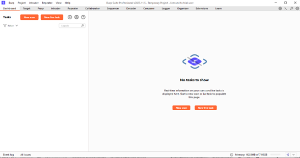

---

### 2. Configuración del Proxy

Nos dirigimos a:

```text
Proxy → Proxy Settings
```

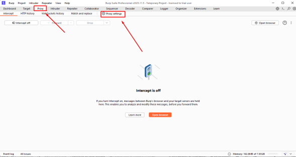

Configuramos el proxy para que escuche en el **puerto 8080** y apunte a **localhost**, ya que el escaneo se realiza desde el mismo equipo.

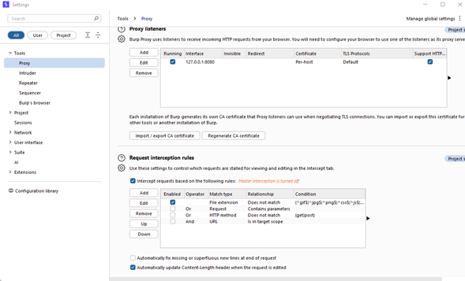

Ejemplo de configuración:

```text
IP: 127.0.0.1
Puerto: 8080
```

---

### 3. Instalación del Certificado CA

Accedemos a la IP y puerto del proxy configurado desde el navegador y damos clic en **CA Certificate** para descargar el certificado.

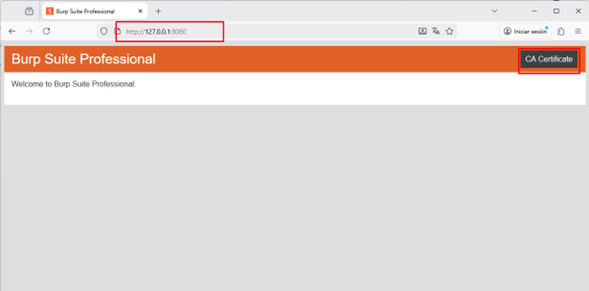

Luego, ingresamos a la configuración del navegador y cargamos el certificado en el apartado de **administración de certificados**.

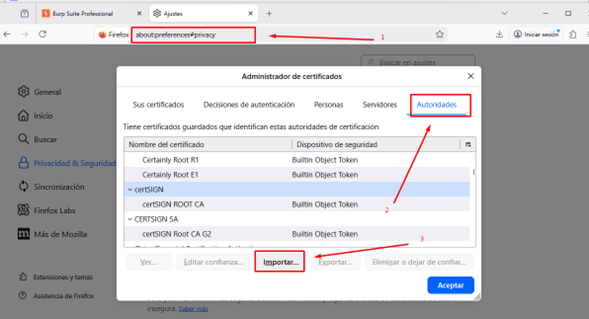

> ⚠️ **Nota:**  
> Este procedimiento se debe hacer para el corecto funcionamiento.

---

### 4. Visualización del Tráfico HTTP

En Burp Suite seleccionamos:

```text
Proxy → HTTP history
```

Aquí se visualizarán todas las solicitudes realizadas desde el navegador.

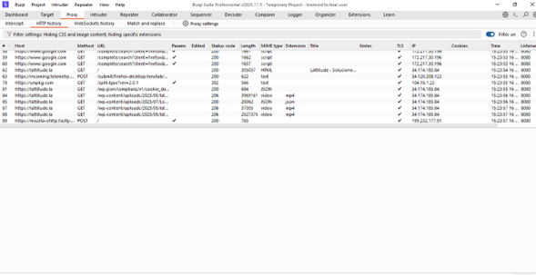

---

### 5. Navegación de la Aplicación Web

Desde el navegador con el certificado instalado, accedemos a la aplicación web objetivo y realizamos una navegación completa por todas sus secciones.

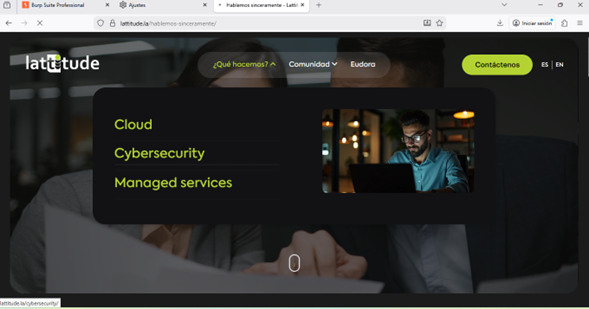

---

### 6. Configuración del Scope y Escaneo

Definimos el alcance del escaneo en:

```text
Target → Lattitude.la → Add scope
```

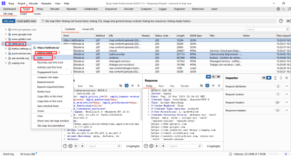

Luego iniciamos el escaneo desde:

```text
Lattitude.la → Scan
```

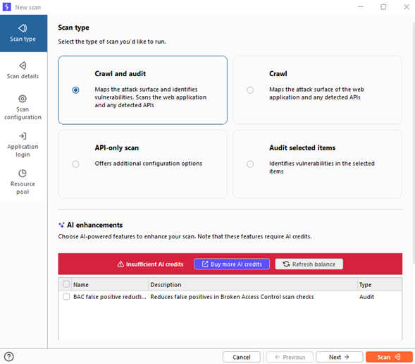

Configuramos el escaneo según los parámetros requeridos.

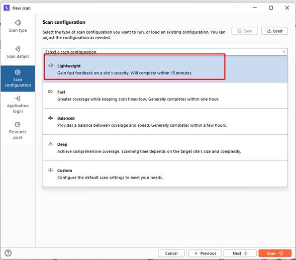

---

### 7. Monitoreo del Escaneo

El estado del escaneo puede visualizarse en el **Dashboard** de Burp Suite.

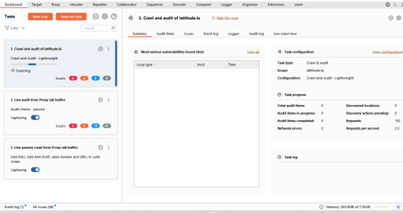

---

### 8. Exportación de Resultados

Una vez finalizado el escaneo, seleccionamos los **Issues** detectados.

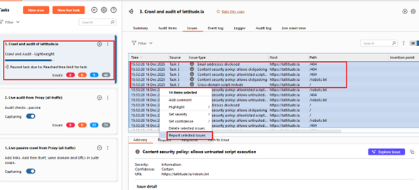

Exportamos los resultados en formato **XML**.

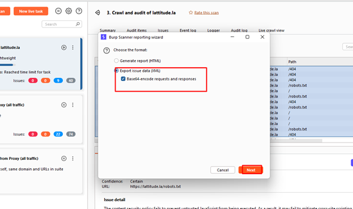


Exportamos los resultados en formato **XML**, listo para ser cargado en **Eudora**.
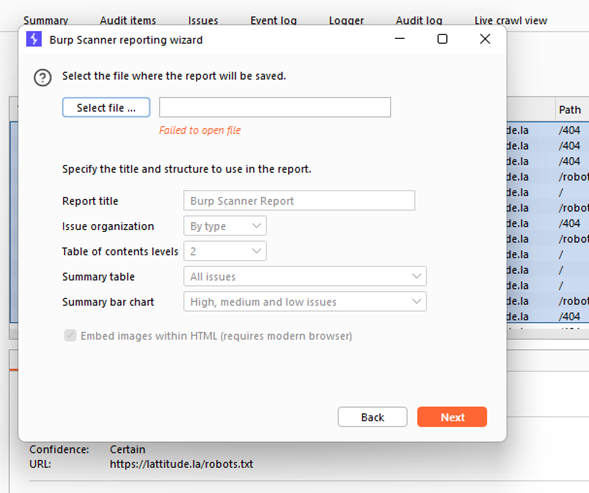


</div>
